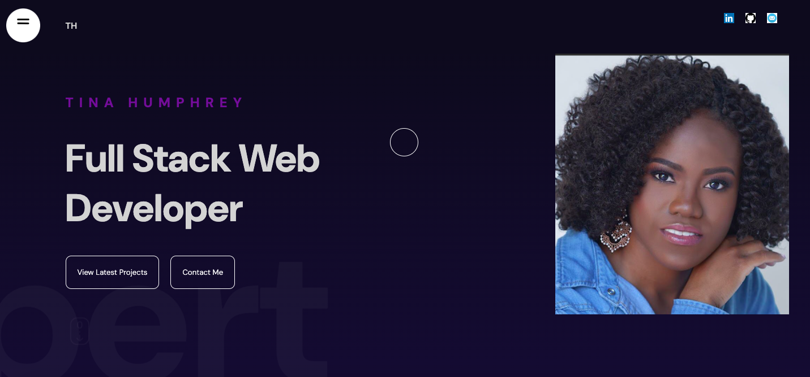

# Tinas-REACT-Portfolio

## Table of Contents 
 * [Description](#Description)
 * [Website](#Website)
 * [Installation](#Installation)
 * [Usage](#Usage)
 * [Collaboration] (#Collaboration)
 * [License](#License)

## Description
A portfolio showcasing my skills and projects for furture employers using React.

## Website

tinasreactportfolio.netlify.app

## Installation
Run the following command `npm i` to install the dependencies

    `@emailjs/browser`
    `framer-motion`
    `react`
    `react-dom`
    `sass`

## Usage
After installing the dependencies, run the command, `npm start` in your terminal and type `localhost:3000` in your 
browswer

Click the sidbear button to scroll to different sections of the portfolio

## Collaboration
This project was collaborated with the help of Lama Dev's Reat Project for Beginners

## License
This project uses MIT license 
